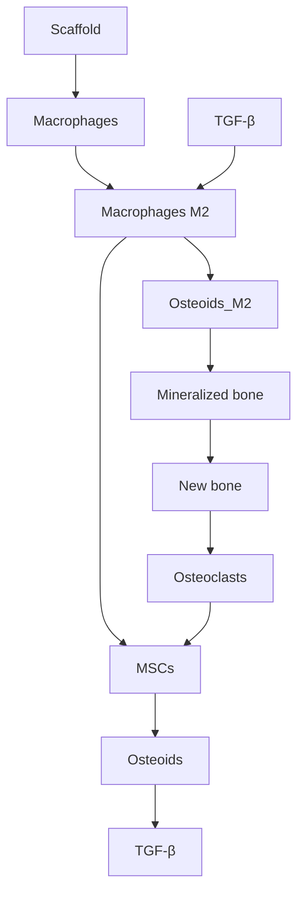

## REVIEW

## Open Access

# Current developments in orthopaedic implant technology

Check for updates

Abdulhamit Misir1,2\*

## Abstract

Orthopaedic implants have significantly improved the treatment of musculoskeletal injuries and degenerative diseases, restoring function and alleviating pain. However, long-term implant success remains challenging due to loosening, wear, and infections. Recent advancements in materials science, bioengineering, and digital technologies are driving innovations in orthopaedic implants, enhancing their performance and patient outcomes. New biomaterials, such as advanced metal alloys, polymers, ceramics, and nanocomposites, ofer superior biocompatibility and mechanical durability, minimizing adverse reactions. Additive manufacturing (3D printing) allows the creation of patient-specific implants with porous architectures closely resembling natura bone, enhancing osseointegration. Additionally, surface engineering techniques, including bioactive coatings for improved bone bonding and antimicrobial layers for infection prevention, address persistent issues at the implant tissue interface. The emergence of “smart” implants equipped with sensors and wireless connectivity enables realtime monitoring of biomechanical parameters, paving the way for personalized, data-driven orthopaedic care. Thi review summarizes significant developments in orthopaedic implant technology from 2020 to 2025, highlighting advances in materials, design, and functionality. We discuss how these innovations address traditional challenges and examine remaining hurdles to clinical application. Future directions, such as biodegradable implants that eliminate secondary surgeries and AI-assisted implant design, are also explored. Collectively, these breakthroughs promise a new era in orthopaedic treatments, marked by enhanced implant longevity, functionality, and patient quality of life.

Keywords Orthopaedic implants, Biomaterials, Additive manufacturing, Biodegradable metals, Antibacterial coatings, Smart implants, Osseointegration, Magnesium alloys, Surface modification, Patient-specific design

\*Correspondence:

Abdulhamit Misir

misirabdulhamitmd@gmail.com

1Department of Orthopedics and Traumatology, Bahçeşehir University

Faculty of Medicine, Istanbul, Turkey

2Medicalpark Goztepe Hospital, Department of Orthopedics and

Traumatology, Bahcesehir University Faculty of Medicine, Merdivenkoy,

E-5 uzeri, Nisan Sk. No:17, Istanbul 34732, Kadikoy, Turkey

## Introduction

The global demand for orthopaedic implants continues to rise with the aging population and increasing prevalence of musculoskeletal conditions [1, 2]. In the United States alone, over 7.5  million orthopaedic devices are implanted each year, and the global orthopaedic implant market (valued at \$46.5  billion in 2018) is projected to reach \$79.5 billion by 2030 [2]. These devices—including joint replacements, fracture fixation plates and screws, and spinal implants—have become indispensable in restoring mobility and relieving pain. However, current implants still face significant clinical challenges that limit their longevity and success. High rates of complications such as infection, poor biological integration, and wearinduced loosening lead to premature failure in a substantial subset of patients [3]. For example, implant-related infections not only cause implant loosening and failure but also impose serious burdens on patients and healthcare systems [2]. Likewise, inadequate osseointegration at the implant–bone interface can result in fibrous tissue formation and mechanical instability, ultimately causing implant loosening due to micromotion, wear debrisinduced inflammation, and immune rejection [3]. Even the choice of implant material can contribute to complications—metallic implants can release ions and particles that trigger chronic inflammation and osteolysis over time [4]. These persistent issues highlight the need for continued innovation in orthopaedic implant technology.

Driven by advances in materials science, bioengineering, and computing, researchers are developing new strategies to make implants safer, more durable, and more biologically compatible. Major research thrusts include the development of advanced biomaterials and coatings to improve biocompatibility and osseointegration, the use of additive manufacturing to create patient-specific and geometrically complex implants, and the integration of sensors and smart technologies into implants for monitoring and therapeutic functions. $\mathtt { B y }$ addressing the root causes of implant failure—from biofilm formation to stress shielding—these technologies aim to extend implant lifespan and improve functional outcomes, especially for the growing cohort of younger and more active implant recipients [3]. In the following sections, we review the main themes in contemporary orthopaedic implant research and development, discuss current advances and translational milestones of the past few years, consider the remaining challenges impeding wider clinical adoption, and explore future directions that may define the next generation of orthopaedic implants.

## Main themes

## Advanced biomaterials for implants

Orthopaedic implants historically rely on metals (such as titanium alloys, stainless steel, and cobalt-chrome) due to their strength and fatigue resistance. Metals like titanium (Ti) and steel are favored for load-bearing applications (joint replacements, intramedullary rods, etc.) because of their excellent mechanical strength, durability, and biocompatibility [4, 5]. Over decades of use, however, limitations of metallic implants have become evident. Long-term metal implants can cause adverse efects including chronic inflammation and pain, often attributed to the release of metallic ions and wear particles into surrounding tissues [4]. Such wear debris from metalon-metal interfaces or metal-polyethylene bearings can induce osteolysis (bone resorption) and ultimately loosening of the implant. These drawbacks have spurred a shift toward new biomaterials designed to better match the biological and mechanical environment of bone.

Polymeric biomaterials have increasingly been introduced to orthopaedic devices to avoid some problems associated with metals. High-performance polymers like polyether ether ketone (PEEK) and bioabsorbable polyesters such as polylactic acid (PLA) are now used in applications ranging from spinal cages to interference screws [4]. PEEK, for example, is a radiolucent, inert polymer with an elastic modulus closer to bone than metal; it is used in spinal interbody implants to reduce stress shielding and allow easier imaging follow-up. Polymer implants ofer lighter weight and eliminate metal-on-metal articulations, thereby reducing the risk of inflammatory responses in joint replacements [4, 5]. Bioabsorbable polymers (PLA, polyglycolic acid (PGA), etc.) have been used for screws and pins that gradually dissolve as the bone heals, obviating the need for hardware removal in certain cases [6, 7]. Ceramics represent another important class of biomaterials in current use. Oxide ceramics like alumina and zirconia feature exceptional hardness and wear resistance, making them ideal for bearing surfaces in hip and knee replacements to minimize wear debris. Calcium phosphate ceramics (e.g., hydroxyapatite coatings) are utilized for their osteoconductivity, helping bone bond to implant surfaces. Each material class—metal, polymer, ceramic—provides specific advantages, and modern implants often combine them to meet complex clinical demands [4]. For instance, a titanium alloy hip stem might be coated with a ceramic layer for wear resistance or paired with a polymer liner to reduce friction. Modern ceramic biomaterials feature interconnected porous architectures that mimic trabecular bone structure (Fig. 1D).

Beyond these traditional materials, composite and hybrid biomaterials are emerging to capitalize on the strengths of multiple components. Carbon fiber–reinforced PEEK is one such composite, marrying PEEK’s biocompatibility with carbon fibers for enhanced strength and stifness closer to bone. This material is already used in load-bearing spinal implants and ofers the bonus of being MRI-compatible (unlike metal) for postoperative imaging [8]. Meanwhile, nanotechnology is being leveraged to create biomaterials that more closely mimic the hierarchical structure of bone and interact favorably with cells. Nanoscale surface features and nano-additives can significantly influence protein adsorption and cell response. Nanomaterials in orthopaedics have shown exceptional properties—for example, nanostructured metals and ceramics often exhibit improved wear characteristics and can be tailored for slow drug release or growth factor delivery [3]. Nanoscale surface modifications (such as $\mathrm { T i O } _ { 2 }$ nanotubes on titanium or nano-hydroxyapatite coatings) can promote osteoblast adhesion and diferentiation, accelerating integration of the implant with host bone [9]. Indeed, nanomaterials have demonstrated a unique ability to mimic the hierarchical structure of native bone, facilitating tissue regeneration and osseointegration while also resisting bacterial colonization [3].

  
Fig. 1 Representative examples of advanced orthopaedic implants. (A) 3D-printed spinal fusion cage with open longitudinal slots. (B) Scanning electron micrograph revealing nanoscale granular topography of a coating material. (C) Hydroxyapatite-coated titanium dome (left) adjacent to a smart tibia component with integrated force sensor (right). (D) Porous trabecular-like ceramic block, with inset magnifying the interconnecting pore network, il lustrating its biomimetic architecture

## Surface engineering and bioactive coatings

While bulk materials provide the structural foundation of an implant, the surface of the implant is what directly contacts the biological environment. Accordingly, surface engineering is a critical focus in implant technology, aimed at optimizing the implant–tissue interface for both stability and infection resistance. A longstanding strategy to improve bone attachment is to create a textured or porous surface on metal implants. Techniques like gritblasting, plasma spraying, and additive manufacturing are used to produce porous titanium surfaces into which bone can grow, achieving biological fixation. For example, titanium stems or acetabular cups with a porous or roughened surface can achieve strong osseointegration, reducing reliance on bone cement. Additionally, bioactive ceramic coatings such as hydroxyapatite (HA) are often applied to implant surfaces to further encourage bone bonding. HA is a mineral chemically similar to bone mineral; when coated on a metal implant, it can enhance osteoconduction, leading to faster and stronger bone integration of the implant [5, 10]. These approaches address the problem of initial stability and long-term fixation, helping to reduce aseptic loosening over time. These surface modifications create nanoscale topographies that enhance cellular interactions (Fig. 1B) and can be combined with bioactive coatings such as hydroxyapatite (Fig. 1C).

In parallel, antibacterial surface coatings have been developed to prevent implant-related infections, which are among the most devastating complications in orthopaedics. Once bacteria adhere to an implant surface and form a biofilm, they are dificult to eradicate and often necessitate implant removal. Antimicrobial coating strategies aim to make the implant surface hostile to bacteria or to provide a sustained release of bactericidal agents in the peri-implant area. Various materials have been explored, including silver, iodine, antibiotic-polymer composites, and antimicrobial peptides. Silver coatings are one prominent example: silver ions are broad-spectrum bactericides. Studies have shown that porous titanium implants coated with silver nanoparticles exhibit significantly reduced bacterial growth (e.g., E. coli and S. aureus were strongly inhibited on Ag-coated Ti surfaces) [3]. Antibiotic-eluting coatings are another approach now reaching clinical use. A notable recent advance is the introduction of gentamicin-coated intramedullary nails for open fractures, which demonstrated a significant reduction in infection rates compared to uncoated nails (approximately 3% vs. 18% infection in a comparative study) [11]. These antibiotic-coated implants provide high local antibiotic concentrations at the implant site during the immediate postoperative period, a critical window for preventing infection in contaminated fractures.

A significant recent FDA approval represents a breakthrough in antibacterial coating technology. In April 2024, Onkos Surgical received FDA De Novo approval for its NanoCept™ antibacterial coating technology, the first FDA-approved antibacterial coating for orthopaedic implants specifically designed for tumor and revision arthroplasty applications [12, 13]. This coating utilizes quaternary ammonium compounds covalently bonded to the implant surface and has demonstrated a high bacterial kill rate in preclinical studies [14] through mechanical disruption of bacterial cell walls upon contact (Fig. 2). The technology mechanically kills bacteria upon contact without using antimicrobial agents that could lead to resistance development. This approval marks a significant milestone as the first commercially available antibacterial coating specifically for high-risk orthopaedic procedures, where patients are particularly vulnerable to infection-related complications [15].

text_image

Antibacterial-coated surface
disrupts bacterial cell walls
Magnified disrupted
bacterial cell walls
NanoCept™ Antibacterial Technology

Fig. 2 NanoCept™ antibacterial coating on an orthopaedic instrument. (top) Photograph of a coated revision arthroplasty instrument bearing the Nano Cept™ quaternary-ammonium surface. (middle inset) Scanning electron micrograph (SEM) showing bacteria whose cell walls have been mechanically disrupted upon contact with the antibacterial coating. (bottom inset) Higher-magnification SEM of disrupted bacterial membranes, demonstrating the formation of micro-tears and cell lysis Reproduced from Onkos Surgical website (https://onkossurgical.com/nanocept/)

Researchers are also creating multifunctional coatings that combine osteointegration and antimicrobial properties. For example, “sandwich” coatings can incorporate an inner layer that releases an antibiotic and an outer bone-bonding layer of HA or bioactive glass [16]. An emerging concept is stimuli-responsive (smart) coatings, which can release drugs or change their properties in response to environmental triggers such as pH or temperature. In infection, local pH often drops and enzymes are released—a smart coating could sense these signals and respond by releasing antibiotics or biofilmdispersing agents [2, 17]. Some coatings are designed to remain inactive until triggered by an infection-related stimulus (for instance, a coating that releases antibiotics only in the acidic environment created by bacteria). This on-demand approach can achieve long-term protection without continuously exposing the tissue to high drug levels [2, 17].

## Additive manufacturing and custom implant design

Additive manufacturing (AM), commonly known as 3D printing, has emerged as a transformative technology in orthopaedics, enabling the production of implants and surgical devices with unprecedented design freedom. Unlike traditional subtractive machining or casting, AM builds components layer-by-layer, which allows for highly customized geometries and internal architectures that were previously infeasible. In the context of orthopaedic implants, 3D-printed technology is being utilized to create patient-specific implants tailored to an individual’s anatomy, as well as to fabricate complex porous structures that mimic the trabecular bone architecture. These capabilities directly address the historical limitation of “one-size-fits-all” implants that often fit suboptimally [1, 4]. With 3D-printed technology, an implant can be designed from a patient’s imaging data (CT/MRI) to match their unique bone contours, correcting deformities or size mismatches that standard implants might not accommodate. This personalization improves the initial fit and alignment of implants, which can translate to better function and longevity.

In addition to geometric customization, additive manufacturing allows functionally optimized structures. For example, lattice or mesh structures can be 3D-printed within an implant to reduce stifness and more closely match the elastic modulus of bone, thereby mitigating stress shielding [1]. These porous lattice regions also serve as scafolding for bone ingrowth, securing biological fixation. Complex lattice designs with graded porosity—denser in some areas, more open in others—can be realized with AM, something extremely dificult with casting or forging. Indeed, 3D-printed porous titanium implants have now become common in certain applications (such as acetabular cups for hip replacement and interbody cages for spine fusion), and clinical reports show excellent bone integration due to their porous architecture [18]. Representative examples of these advanced manufacturing techniques include 3D-printed spinal fusion cages with optimized porosity (Fig.  1A). Additive manufacturing is also used to produce patientspecific surgical guides and jigs that improve the accuracy of implant placement, indirectly benefiting implant outcomes by ensuring proper alignment.

A variety of 3D-printed techniques are applied in orthopaedics: powder bed fusion (e.g., electron beam or laser sintering of metal powders) is frequently used for metallic implants, while material extrusion or jetting can produce polymer or composite implants and scafolds. Moreover, an exciting extension of AM is bioprinting, where cells and biomaterials (bio-inks) are 3D-printed together to create living tissue constructs. While still mostly in the research stage, bioprinting has been used to fabricate osteochondral grafts and could, in the future, produce hybrid implants that come seeded with the patient’s own cells to facilitate integration [1, 9].

Despite its enormous promise, additive manufacturing in orthopaedics faces several practical challenges. One issue is ensuring consistent mechanical properties and structural integrity of 3D-printed parts [1, 19]. AMproduced implants can have variability in microstructure or internal flaws (unmelted particles, voids) that must be carefully controlled through process parameters and quality assurance to avoid reduced fatigue life. Regulatory complexities also arise, as traditional standards for implant materials and manufacturing may not directly apply to novel 3D-printed structures [1]. Each patientspecific implant might be considered a “custom device,” complicating the approval process, and there is ongoing work on creating standards and validation protocols for AM implants.

## Sensor-Enabled and “smart” implants

A new frontier in orthopaedic implant technology is the development of “smart” implants—implants embedded with sensors, microelectronics, and sometimes actuators, with the aim of monitoring the implant’s environment or performance in vivo and potentially responding to changes. Traditional orthopaedic hardware is passive, but smart implants ofer the allure of active data collection and even therapeutic intervention from within the body. In general, a smart orthopaedic implant is one that retains the mechanical function of a standard implant but is augmented with the “intelligence” of data-logging or transmitting sensors [20]. These sensors can measure parameters like load, strain, pressure, motion, or temperature at the implant site.

One of the first areas to see development of smart implants was in joint arthroplasty. Prototype smart tibial components in total knee replacements have been built with embedded force sensors that measure the loads in the knee during various activities. These devices can transmit data wirelessly to help clinicians understand the loading patterns on the joint and detect any imbalance or implant loosening [21]. Clinical research with instrumented knee implants has shown the feasibility of capturing real-time orthopedic data; for instance, such sensors can detect subtle changes in load distribution that might indicate ligamentous issues or component subsidence [22].

The spine field has also been a focus, with smart spina rods and interbody devices under development. In spinal fusion surgeries, knowing how the loads are shared between the hardware and the forming bone can indicate whether a fusion is progressing. Smart spinal implants equipped with strain gauges have been used experimentally to measure the bending and compressive loads on rods and cages [20]. By providing real-time information on the loading environment, smart spinal implants could alert clinicians to issues like pseudarthrosis (failed fusion) much earlier than standard radiographic assessment [20].

Key challenges in smart implant design include biocompatibility and durability of the electronic components, power supply, and data transmission. Implants must endure the harsh bodily environment and repeated mechanical loading without sensor failure. Approaches to power these devices range from inductive power transfer (wireless charging) to energy harvesting [22]. Data from the implant can be transmitted via Bluetooth or other wireless protocols to an external reader; ensuring secure and reliable data communication through tissue is an active area of development.

## Biodegradable and bioabsorbable implants

While most orthopaedic implants are intended to serve as long-term or permanent replacements for bone, there is a parallel development of biodegradable implants that gradually dissolve after serving their function. The rationale for bioabsorbable implants is compelling in certain scenarios: for temporary fracture fixation or pediatric applications, a device that provides initial stability and then safely resorbs could eliminate the need for a second surgery to remove hardware and reduce long-term foreign material in the body. Early bioabsorbable orthopaedic devices were made of polymers such as PLA and polyglycolide (PGA), introduced in the late 20th century for use in pins, screws, and tacks [6, 7]. These polymer implants degrade by hydrolysis into biologically tolerable byproducts (eventually metabolized into $\mathrm { C O } _ { 2 }$ and water). The advantages include their gradual load transfer to healing bone (reducing stress shielding as the implant vanishes) and avoidance of stress risers or imaging artifacts once dissolved.

However, polymer implants also faced significant issues beyond their limited mechanical strength compared to metal. A particularly concerning phenomenon is the “burst” degradation efect, where minimal bioabsorption occurs for extended periods followed by sudden, rapid degradation accompanied by intense inflammatory response [23, 24]. This burst efect can cause significant tissue inflammation, pain, and may require revision surgery in some cases, with the unpredictable timing of this response remaining a major limitation of current polymer implant technology [15, 26]. The acid byproducts of PLA/PGA degradation can also cause local inflammation or cyst formation, particularly when high concentrations of degradation products accumulate faster than they can be cleared by local tissues [14, 27].

A major advance in biodegradable implant technology has been the development of biodegradable metals, particularly magnesium (Mg) alloys. Magnesium-based implants marry the strength and stifness of metal with the ability to be absorbed by the body over time. Magnesium is an attractive choice because it is an essential element naturally present in bone (as $\mathrm { M g ^ { 2 + } } )$ and is highly biocompatible [27, 28]. In fact, Mg ions released during degradation can stimulate bone cell activity and promote osteoblast diferentiation; studies have found that magnesium can promote new bone formation and potentially accelerate healing [15, 16, 29]. The mechanism of scaffold-mediated bone regeneration involves complex cellular interactions, including macrophage polarization and subsequent osteoblast diferentiation (Fig.  3). Critically, magnesium alloys have an elastic modulus (41–45 GPa) closer to that of natural bone (15–30 GPa) than stainless steel (200 GPa) or titanium (110 GPa)—this helps to mitigate stress shielding and maintain bone loading to prevent disuse osteopenia [27, 30]. Magnesium-based implants not only provide mechanical support comparable to traditional metals but also actively promote peri-implant bone formation through ${ \mathrm { M g } } ( { \mathrm { O H } } ) _ { 2 }$ ‐driven osteogenesis and CGRP-mediated signaling, with these mechanisms contributing to enhanced osseointegration and tissue regeneration [27].

Despite these advantages, challenges remain before biodegradable metals see routine clinical use. Magnesium alloys tend to corrode too quickly in physiological conditions, generating hydrogen gas and losing mechanical integrity faster than the bone can heal [27, 31, 32]. An excessively rapid degradation can lead to loss of fixation and can cause complications from gas bubble formation or alkalinity changes around the implant. To address this, researchers are tailoring Mg alloys with alloying elements (like zinc, calcium, rare earths) and applying surface treatments or coatings to modulate the corrosion rate [24, 33]. Current strategies focus on achieving an optimal balance between mechanical support and degradation: the implant should stay intact for the critical healing period and then gradually dissolve once the bone is suficiently strong [27]. Early clinical trials in humans have begun: biodegradable Mg screws have been used in certain indications like hallux valgus surgery and distal radius fractures, with trials demonstrating good biocompatibility and progressive absorption of the screws over months, with bone filling in the space [23, 34].

flowchart

Fig. 3 Schematic representation of scafold-mediated bone regeneration and macrophage polarization in bone healing. The figure illustrates a biodegradable scafold implanted within a bone defect, releasing magnesium (Mg²⁺) and calcium $( C a ^ { 2 + } )$ ions as shown in the magnified circular inset. M1 macrophages are recruited to the scafold site and undergo polarization to M2 macrophages through the influence of released ions and local microenvironmental factors. M2 macrophages secrete transforming growth factor-beta (TGF-β), which promotes the recruitment and diferentiation of mesenchymal stem cells (MSCs) into osteoblasts. The osteoblasts then diferentiate into osteoids, which further mature into osteoclasts through the bone remodeling cycle. This coordinated cellular response ultimately leads to new bone formation at the defect site. The arrows indicate the directional flow of cellular diferentiation and signaling pathways involved in scafold-mediated bone regeneration. The scafold structure shows a po rous architecture that facilitates cell infiltration and tissue ingrowth while providing mechanical support during the healing process

In addition to magnesium, other biodegradable metals being explored include iron (Fe) and zinc (Zn) alloys, each with diferent degradation profiles and mechanical properties suited to specific applications [35]. Iron corrodes too slowly for most applications (taking years to dissolve), but novel iron-based alloys or composites are being designed for a more suitable corrosion profile. Zinc is another essential element with moderate corrosion rate, and Zn-based alloys are under investigation for lowload implants [26, 27, 36].

## Current advances

In the past five years (2020–2025), many of the aforementioned innovations have moved from theoretical concepts toward clinical reality [3]. Several notable current advances highlight the rapid progress in orthopaedic implant technology:

3D-printed, porous metal implants are now in regular clinical use, improving osseointegration and customization. Patient-specific titanium alloy implants with lattice structures (produced via laser sintering) have been successfully used in complex joint reconstructions and spinal fusion. These porous designs significantly enhance bone ingrowth and have shown excellent early fixation in patients [1]. The ability to match an implant to a patient’s unique anatomy has reduced issues of misalignment and component mismatch, leading to better functional outcomes in cases ranging from revision acetabular cups to custom tumor resection prostheses.

Antimicrobial coatings have demonstrated eficacy in reducing infections in high-risk surgeries. Gentamicin-coated intramedullary nails for open tibia fractures have shown markedly lower deep infection rates than uncoated nails at 1-year follow-up [11]. Similarly, silvercoated megaprostheses used in orthopedic oncology have reported substantially lower infection rates compared to standard implants. The FDA approval of Onkos Surgical’s NanoCept™ antibacterial coating in 2024 represents the first commercially available antibacterial coating specifically designed for high-risk orthopaedic procedures [12, 13].

Nanostructured and composite coatings are moving from lab studies to preclinical and clinical trials. Researchers have developed multifunctional nanoscale coatings that concurrently promote bone growth and fight bacteria. Recent studies report biomimetic coatings composed of silk fibroin, nano-hydroxyapatite, and silver nanoparticles that significantly improved osteoblast adhesion while inhibiting bacterial biofilm formation [3, 37].

Bioabsorbable magnesium implants have entered clinical evaluation. Magnesium alloy screws and pins are being tested in human patients for indications like small bone fracture fixation. Early clinical reports note that Mg screws maintain fixation during the required healing period and then gradually dissolve with minimal adverse efects; follow-up imaging confirmed new bone formation in place of the degraded implant [23, 27, 34]. Advanced imaging techniques have documented the progressive biodegradation of magnesium-based implants over time, showing gradual dissolution with concurrent bone formation (Fig. 4).

natural_image

Four 3D models of screw implants labeled a, b, c, d, each with 2mm scale bar (no text or symbols on models)

Fig. 4 In vivo biodegradation of a magnesium-based absorbable screw by X-ray synchrotron micro-CT (after Tsakiris et al]. (a) Initial implant state, (b) Three-dimensional reconstruction at 1 month post-implantation, (c) Reconstruction at 4 months, (d) Reconstruction at 7 months (Source: Tsakiris V, Tardei C, Clicinschi FM. Biodegradable Mg alloys for orthopedic implants – A review. J Magnesium Alloys. 2021;9(6):1884–1905. https:/ doi.org/10.1016/j.jma.2021.06.024)

Smart implant prototypes are transitioning to firstin-human use. Sensor-enabled tibial trays in total knee arthroplasty have successfully transmitted joint load data during daily activities. Instrumented spine rod systems are being implanted in clinical trial patients to transmit real-time load across the fusion site. Although numbers are still small, these pioneering cases are proving the concept that implants can be both therapeutic and diagnostic devices [22].

## Challenges

Despite impressive advancements, significant challenges remain before many innovations can achieve widespread clinical adoption. Biological challenges inherent to introducing foreign materials into the human body persist. The fundamental issues that have long plagued implants—infection, aseptic loosening, and wear-induced osteolysis—have not been completely solved. While antibacterial coatings can reduce infection risk, there is concern about potential development of antibiotic resistance [2] or unforeseen local side efects of novel antimicrobial agents.

Mechanically, new implant designs and materials must prove they are at least as reliable and durable as conventional implants. Device longevity is a pressing issue—registry data indicate that a notable percentage of implants still fail within 10–20 years (e.g., about 17% of knee replacements in patients under 55 fail within 20 years) [22]. Any new material or design needs extensive fatigue testing to ensure it can endure decades of cyclic loading. The degradation behavior of bioabsorbable implants poses another challenge—unexpected rapid loss of mechanical support or an inflammatory reaction to degradation byproducts could compromise outcomes [27].

On the regulatory and standardization front, bringing advanced implants to market is a slow process. Regulatory bodies require substantial evidence of safety and eficacy, especially for first-of-kind technologies. For patient-specific 3D-printed implants, ensuring each custom piece meets quality standards akin to mass-produced implants is challenging [1]. Additionally, the cost of many new technologies is high—manufacturing a custom implant or a sensor-embedded device is typically more expensive than a conventional implant.

## Future directions

Looking ahead, orthopaedic implants are poised to become even more biologically integrated, intelligent, and personalized. One major theme is the convergence of implants with regenerative medicine. Rather than viewing an implant as an inert replacement part, future implants may work in harmony with the body to stimulate true tissue regeneration [2, 3]. Future implant surfaces might be bioengineered at the molecular level to recruit stem cells or growth factors from the body, enhancing tissue repair.

Another direction is the development of smart materials and advanced manufacturing techniques to create implants with unparalleled functionality. Functionally graded materials (FGMs) are one such approach, where an implant is composed of a gradient of materials to better distribute stress and mimic the transitions found in natural tissues [4]. 4D printing is an emerging concept— these are 3D-printed objects designed to change shape or properties over time in response to stimuli [38].

The increasing incorporation of digital technology and artificial intelligence (AI) into orthopaedics will also shape implant design and postoperative care. AI is expected to play a significant role in implant optimization—using large datasets to virtually design the optimal implant for each patient. Integrating AI techniques in implant development has been shown to produce enhanced designs that better integrate with host bone [25]. Machine learning models could establish what patterns of implant load or micromotion predict an impending failure, allowing truly preventative maintenance in orthopaedics.

Finally, sustainability and accessibility will become important considerations. Open-source implant designs and decentralized manufacturing (point-of-care 3D printing) might allow remote or under-resourced hospitals to produce custom implants without waiting weeks for shipment [3].

## Conclusion

Orthopaedic implant technology is undergoing a renaissance driven by multidisciplinary innovations. Implants are evolving from simple inert hardware into sophisticated constructs that engage the biology and biomechanics of the host. Current advances in materials (e.g., nanostructured alloys, polymers, and composites), surface modifications (bioactive and antibacterial coatings), manufacturing methods (custom 3D-printed geometries), and implant intelligence (sensors and data integration) are collectively addressing the long-standing challenges of implant failure. These technologies are enabling implants to last longer, integrate more fully with bone, and even communicate information about their performance.

Nevertheless, realizing the full potential of these innovations requires overcoming remaining challenges in reliability, safety, and cost-efectiveness. Robust clinical evidence and refinement of techniques will be essential to translate early successes into standard practice [3]. The field is trending towards solutions that are more personalized, more physiologically harmonious, and more proactive in maintaining joint and bone health. Future orthopaedic implants may not only replace damaged tissues but actually help regenerate them, and they may not only withstand the stresses of the body but actively adapt to and moderate those stresses. Continued collaboration between researchers, surgeons, and industry will be critical to drive these innovations forward. With careful navigation of the challenges and a commitment to rigorous validation, the coming generation of orthopaedic implants promises to improve implant longevity, reduce complications, and enhance the quality of life for patients with musculoskeletal conditions.

## Author contributions

A.M. wrote the revised manuscript text and reviewed the final version of the manuscript.

## Funding

There is no funding to report related to this study.

## Data availability

No datasets were generated or analysed during the current study

## Declarations

## Declaration of generative AI and AI-assisted technologies in the writing process

During the preparation of this work the authors used ChatGPT-4, developed by OpenAI (San Francisco, California, USA), to address language related errors After using this tool/service, the authors reviewed and edited the content as needed and take full responsibility for the content of the publication.

## Conflict of interest

The author, his immediate family, and any research foundation with which they are afiliated did not receive any financial payments or other benefits from any commercial entity related to the subject of this article.

Received: 8 May 2025 / Accepted: 30 August 2025

Published online: 28 October 2025

## References

1. Cong B, Zhang H. Innovative 3D printing technologies and advanced materials revolutionizing orthopedic surgery: current applications and future directions. Front Bioeng Biotechnol. 2025;13:1542179. https://doi.org/10.3389 /fbioe.2025.1542179  
2. Chen X, Zhou J, Qian Y, Zhao L. Antibacterial coatings on orthopedic implants. Mater Today Bio. 2023;19:100586. https://doi.org/10.1016/j.mtbio.20 23.100586  
3. Liang W, Zhou C, Bai J, Zhang H, Long H, Jiang B, Dai H, Wang J, Zhang H, Zhao J. Current developments and future perspectives of nanotechnol ogy in orthopedic implants: an updated review. Front Bioeng Biotechnol. 2024;12:1342340. https://doi.org/10.3389/fbioe.2024.1342340  
4. Lodge CJ, Matar HE, Berber R, Radford PJ, Bloch BV. Ceramic coatings confer no survivorship advantages in total knee Arthroplasty—A Single-Center series of 1641 knees. Arthroplast Today. 2023;19:101086. https://doi.org/10.10 16/j.artd.2022.101086  
5. Marin E, Lanzutti A. Biomedical applications of titanium alloys: A comprehensive review. Mater (Basel). 2023;17(1):114. https://doi.org/10.3390/ma1701011 4  
6. Reddy MSB, Ponnamma D, Choudhary R, Sadasivuni KK. A comparative review of natural and synthetic biopolymer composite scafolds. Polymers 2021;13(7):1105. https://doi.org/10.3390/polym13071105  
7. García-Sobrino R, Muñoz M, Rodríguez-Jara E, Rams J, Torres B, Cifuentes SC Bioabsorbable composites based on polymeric matrix (PLA and PCL) reinforced with magnesium (Mg) for use in bone regeneration therapy: physicochemical properties and biological evaluation. Polymers. 2023;15(24):4667. ht tps://doi.org/10.3390/polym15244667  
8. Hubertus V, Wagner A, Albrecht C, et al. Carbon fiber-reinforced PEEK implants in oncologic spine surgery: a multicenter experience on implications for postoperative patient management. J Neurosurg Spine. 2025;42(5):605–14. https://doi.org/10.3171/2024.10.SPINE24753. Published 2025 Feb 21.  
9. Zhang LC, Chen LY. A review on biomedical titanium alloys: recent progress and prospect. Adv Eng Mater. 2019;21(4):1801215. https://doi.org/10.1002/ad em.201801215  
10. Ajami E, Fu C, Wen HB, Bassett J, Park SJ, Pollard M. Early bone healing on Hydroxyapatite-Coated and Chemically-Modified hydrophilic implant surfaces in an ovine model. Int J Mol Sci. 2021;22(17):9361. https://doi.org/10.33 90/ijms22179361  
11. Rai SK, Gupta TP, Kashid M, Sirohi B, Kale A, Sharma R, Gandotra A. Does a gentamicin-coated intramedullary nail prevent postoperative infection in Gustilo type I and II tibial open fractures? A comparative study and retrospective analysis. Eur J Trauma Emerg Surg. 2025;51(1):86. https://doi.org/10.1007/ s00068-025-02763-4  
12. Onkos Surgical. Onkos surgical announces first FDA de Novo approval of an antibacterial coating for tumor and revision orthopaedic implants. Press Release April 8, 2024.  
13. Lainioti GC, Druvari D. Designing Antibacterial-Based quaternary ammonium coatings (Surfaces) or films for biomedical applications: recent advances. Int J Mol Sci. 2024;25(22):12264. https://doi.org/10.3390/ijms252212264  
14. Pan Z, Liu Z, Yang S, Shen Z, Wu Y, Liu Y, Li J, Wang L. Covalent grafting of qua ternary ammonium Salt-Containing polyurethane onto silicone substrates to  
enhance bacterial Contact-Killing ability. Polymers. 2025;17(1):17. https://doi. org/10.3390/polym17010017  
15. Antoniac I, Manescu VP, Antoniac A, Paltanea G. Magnesium-based alloys with adapted interfaces for bone implants and tissue engineering. Regen Biomater. 2023;10:rbad095. https://doi.org/10.1093/rb/rbad095  
16. He M, Chen L, Yin M, Xu S, Liang Z. Review on magnesium and magnesiumbased alloys as biomaterials for bone immobilization. J Mater Res Technol. 2023;23:4396–419. https://doi.org/10.1016/j.jmrt.2023.02.037  
17. Blum AP, Kammeyer JK, Rush AM, et al. Stimuli-responsive nanomaterials for biomedical applications. J Am Chem Soc. 2015;137(6):2140–54. https://doi.o g/10.1021/ja510147n  
18. Arabnejad S, Johnston B, Tanzer M, Pasini D. Fully porous 3D printed titanium femoral stem to reduce stress-shielding following total hip arthroplasty. J Orthop Res. 2017;35(8):1774–83. https://doi.org/10.1002/jor.23445  
19. Wan Z, Zhang P, Liu Y, Lv L, Zhou Y. Four-dimensional bioprinting: current developments and applications in bone tissue engineering. Acta Biomater. 2020;101:26–42. https://doi.org/10.1016/j.actbio.2019.10.038  
20. Kim SJ, Wang T, Pelletier MH, Walsh WR. SMART implantable devices for spina implants: a systematic review on current and future trends. J Spine Surg. 2022;8(1):117–31. https://doi.org/10.21037/jss-21-100  
21. Iyengar KP, Gowers BTV, Jain VK, Ahluwalia RS, Botchu R, Vaishya R. Smart sensor implant technology in total knee arthroplasty. J Clin Orthop Trauma. 2021;22:101605. https://doi.org/10.1016/j.jcot.2021.101605  
22. Kelmers E, Szuba A, King SW, Palan J, Freear S, Pandit HG, van Duren BH. Smart knee implants: an overview of current technologies and future possibilities. Indian J Orthop. 2022;57(5):635–42. https://doi.org/10.1007/s43465-022-0081 0-5  
23. Zhang T, Wang W, Liu J, Wang L, Tang Y, Wang K. A review on magnesium alloys for biomedical applications. Front Bioeng Biotechnol. 2022;10:953344. https://doi.org/10.3389/fbioe.2022.953344. Published 2022 Aug 16.  
24. Li L, Zhang M, Li Y, Zhao J, Qin L, Lai Y. Corrosion and biocompatibility improvement of magnesium-based alloys as bone implant materials: a review. Regen Biomater. 2017;4(2):129–37. https://doi.org/10.1093/rb/rbx004  
25. Akhtar MN, Haleem A, Javaid M, Mathur S, Vaish A, Vaishya R. Artificial intelligence-based orthopaedic perpetual design. J Clin Orthop Trauma. 2024;49:102356. https://doi.org/10.1016/j.jcot.2024.102356  
26. Singh K, Mohan S, Ruggiero A, Bazli L, Haq MIU. Biocompatibility and mechanical performance of magnesium alloys for biomedical application—a state of the Art review. Proc Inst Mech Eng H. 2024;238(9):835–58. https://doi org/10.1177/13506501241275231  
27. Lu Y, Deshmukh S, Jones I, Chiu YL. Biodegradable magnesium alloys for orthopaedic applications. Biomater Transl. 2021;2(3):214–35. https://doi.org/1 0.12336/biomatertransl.2021.03.005  
28. Dachasa B, Motuma B, Dabesa B. Magnesium-Based biodegradable alloy materials for bone healing application. Adv Mater Sci Eng. 2024;2024:1325004. https://doi.org/10.1155/2024/1325004  
29. Shan Z, Xie X, Wu X, Zhuang S, Zhang C. Development of degradable magnesium-based metal implants and their function in promoting bone metabolism (A review). J Orthop Translat. 2022;36:184–93. https://doi.org/10. 1016/j.jot.2022.09.013  
30. Giavaresi G, Bellavia D, De Luca A, Costa V, Raimondi L, Cordaro A, Sartori M, Terrando S, Toscano A, Pignatti G, et al. Magnesium alloys in orthopedics: A systematic review on approaches, coatings and strategies to improve biocompatibility, osteogenic properties and osteointegration capabilities. Int J Molr Sci. 2024;25(1):282. https://doi.org/10.3390/ijms25010282  
31. Khalili MA, Tamjid E. Controlled biodegradation of magnesium alloy in physi ological environment by metal organic framework nanocomposite coatings. Sci Rep. 2021;11:8645. https://doi.org/10.1038/s41598-021-87783-x  
32. Chagnon M, Guy LG, Jackson N. Evaluation of magnesium-based medica devices in preclinical studies: challenges and points to consider. Toxicol Pathol. 2019;47(3):390–400.  
33. Xing F, Li S, Yin D, Xie J, Rommens PM, Xiang Z, Liu M, Ritz U. Recent progress in Mg-based alloys as a novel bioabsorbable biomaterials for orthopedic applications. J Magnes Alloy. 2022;10(6):1428–56. https://doi.org/10.1016/j.jm a.2022.05.014  
34. Fu X, Wang GX, Wang CG, Li ZJ. Comparison between bioabsorbable magnesium and titanium compression screws for hallux valgus treated with distal metatarsal osteotomies: A meta-analysis. Jt Dis Relat Surg. 2023;34(2):289–97. https://doi.org/10.52312/jdrs.2023.1026. Published 2023 May 12  
35. Limón I, Bedmar J, Fernández-Hernán JP, Multigner M, Torres B, Rams J, Cifuentes SC. A review of additive manufacturing of biodegradable Fe and Zn alloys for medical implants using laser powder bed fusion (LPBF). Materials. 2024;17(24):6220. https://doi.org/10.3390/ma17246220  
36. Rousselle SD, Ramot y, Nyska A, Jackson ND. Pathology of bioabsorbable implants in preclinical studies. Toxicol Pathol. 2019;47(3):358–78  
37. Zhang Y, Chen X, Li Y, Bai T, Li C, Jiang L, Liu Y, Sun C, Zhou W. Biomimetic inorganic Nanoparticle-Loaded silk Fibroin-Based coating with enhanced antibacterial and osteogenic abilities. ACS Omega. 2021;6(44):30027–39. http s://doi.org/10.1021/acsomega.1c04734  
38. Mahmood A, Akram T, Shenggui C, Chen H. Revolutionizing manufacturing: A review of 4D printing materials, stimuli, and cutting-edge applications. Compos Part B Eng. 2023;266:110952. https://doi.org/10.1016/j.compositesb. 2023.110952

## Publisher’s note

Springer Nature remains neutral with regard to jurisdictional claims in published maps and institutional afiliations.